<!-- README.md is generated from README.Rmd. Please edit that file -->

# Análise do Doutorado

## Carregando os pacotes

``` r
library(tidymodels)
library(tidyverse)
library(patchwork)
library(ggspatial)
library(modeldata)
library(ggridges)
library(readxl)
library(fco2r)
library(skimr)
library(ISLR)
library(vip)
```

## Lendo o Banco de dados

``` r
anomalias <- readr::read_rds("data/anomalias.rds")
glimpse(anomalias)
#> Rows: 79,494
#> Columns: 16
#> $ tratamento <chr> "UC", "UC", "UC", "UC", "UC", "UC", "UC", "UC", "UC", "UC",…
#> $ lat        <dbl> -8.620781, -8.620781, -8.620781, -8.869740, -8.869740, -8.8…
#> $ long       <dbl> -62.33607, -62.83555, -72.07608, -54.59401, -61.33709, -61.…
#> $ x          <dbl> 4082521, 4027557, 3011106, 4934661, 4192994, 4165529, 40831…
#> $ y          <dbl> 9036687, 9035452, 8999656, 9019104, 9011189, 9010638, 90088…
#> $ data       <dttm> 2015-01-01, 2015-01-01, 2015-01-01, 2015-01-01, 2015-01-01…
#> $ mês        <dbl> 1, 1, 1, 1, 1, 1, 1, 1, 1, 1, 1, 1, 1, 1, 1, 1, 1, 1, 1, 1,…
#> $ ano        <dbl> 2015, 2015, 2015, 2015, 2015, 2015, 2015, 2015, 2015, 2015,…
#> $ estacao    <chr> "chuvosa", "chuvosa", "chuvosa", "chuvosa", "chuvosa", "chu…
#> $ xco2       <dbl> NA, NA, NA, NA, NA, NA, NA, NA, NA, NA, NA, NA, NA, NA, NA,…
#> $ sif        <dbl> NA, NA, NA, NA, NA, NA, NA, NA, NA, NA, NA, NA, NA, NA, NA,…
#> $ ndvi       <dbl> 0.489, 0.664, 0.488, 0.813, 0.636, 0.700, 0.577, 0.891, 0.5…
#> $ lai        <dbl> 2.300, 2.975, 2.900, 5.550, 3.250, 1.900, 1.400, 3.350, 2.0…
#> $ lst_amp    <dbl> NA, NA, 10.89, 7.38, 5.02, 4.14, NA, NA, NA, NA, 4.46, NA, …
#> $ mediana    <dbl> 403.04, 403.04, 403.04, 403.04, 403.04, 403.04, 403.04, 403…
#> $ anomalia   <dbl> NA, NA, NA, NA, NA, NA, NA, NA, NA, NA, NA, NA, NA, NA, NA,…
```

``` r
skimr::skim(anomalias %>% 
              select(xco2:lst_amp))
```

|  |  |
|:---|:---|
| Name | anomalias %\>% select(xco2… |
| Number of rows | 79494 |
| Number of columns | 5 |
| \_\_\_\_\_\_\_\_\_\_\_\_\_\_\_\_\_\_\_\_\_\_\_ |  |
| Column type frequency: |  |
| numeric | 5 |
| \_\_\_\_\_\_\_\_\_\_\_\_\_\_\_\_\_\_\_\_\_\_\_\_ |  |
| Group variables | None |

Data summary

**Variable type: numeric**

| skim_variable | n_missing | complete_rate | mean | sd | p0 | p25 | p50 | p75 | p100 | hist |
|:---|---:|---:|---:|---:|---:|---:|---:|---:|---:|:---|
| xco2 | 70124 | 0.12 | 403.28 | 2.16 | 394.46 | 402.07 | 403.56 | 404.64 | 411.71 | ▁▂▇▂▁ |
| sif | 74786 | 0.06 | 0.86 | 0.31 | 0.00 | 0.65 | 0.85 | 1.11 | 1.50 | ▁▃▇▆▃ |
| ndvi | 19 | 1.00 | 0.73 | 0.16 | -0.16 | 0.64 | 0.80 | 0.85 | 0.99 | ▁▁▂▅▇ |
| lai | 0 | 1.00 | 4.10 | 1.79 | 0.00 | 2.60 | 4.38 | 5.80 | 6.90 | ▂▅▅▅▇ |
| lst_amp | 18369 | 0.77 | 6.48 | 2.52 | 0.00 | 4.86 | 6.21 | 7.80 | 25.78 | ▃▇▁▁▁ |

## FAZER O RIDGE AQUI…

``` r
anomalias %>% 
  mutate(
    fct_ano = fct_rev(as.factor(ano)),
    classe = ifelse(tratamento == "UC_desm" | tratamento == "TI_desm",
                    "Des","Con")
    ) %>% 
  ggplot(aes(y=fct_ano)) +
  geom_density_ridges(rel_min_height = 0.03,
    aes(x=xco2, fill=classe),
    alpha = .6, color = "black", from = 395, to = 413
    ) +
  scale_fill_cyclical(values = c("#238B45","#ff8080"),
                      name = "classe", guide = "legend") +
  theme_ridges() 
```

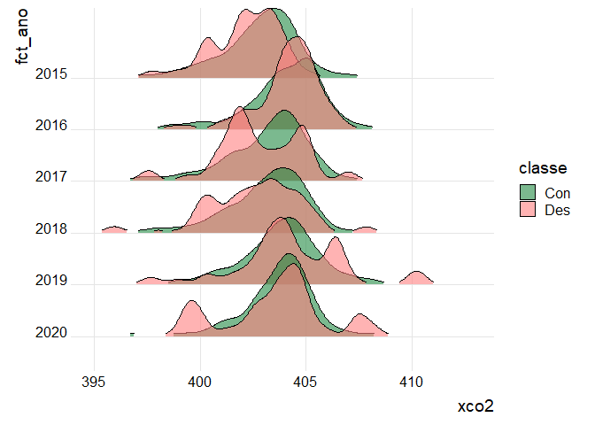<!-- -->

``` r
anomalias %>% 
  mutate(
    fct_ano = fct_rev(as.factor(ano)),
    classe = ifelse(tratamento == "UC_desm" | tratamento == "TI_desm",
                    "Des","Con")
    ) %>% 
  ggplot(aes(y=fct_ano)) +
  geom_density_ridges(rel_min_height = 0.03,
    aes(x=anomalia, fill=classe),
    alpha = .6, color = "black", from = -10, to = 10
    ) +
  scale_fill_cyclical(values = c("#238B45","#ff8080"),
                      name = "classe", guide = "legend") +
  theme_ridges() 
```

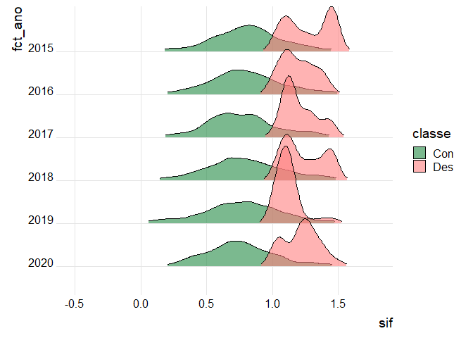<!-- -->

## RIDGE SIF

## FAZER O RIDGE AQUI…

``` r
anomalias %>% 
  mutate(
    fct_ano = fct_rev(as.factor(ano)),
    classe = ifelse(tratamento == "UC_desm" | tratamento == "TI_desm",
                    "Des","Con")
    ) %>% 
  ggplot(aes(y=fct_ano)) +
  geom_density_ridges(rel_min_height = 0.03,
    aes(x=sif, fill=classe),
    alpha = .6, color = "black", from = -.5, to = 1.8
    ) +
  scale_fill_cyclical(values = c("#238B45","#ff8080"),
                      name = "classe", guide = "legend") +
  theme_ridges() 
```

<!-- -->

## lendo a Base para o Aprendizado de Máquina

``` r
data_set_ml <- anomalias %>% 
  mutate(
    fct_ano = fct_rev(as.factor(ano)),
    classe = as_factor(ifelse(tratamento == "UC_desm" | tratamento == "TI_desm",
                    "Des","Con")
    )) %>% #<-------
  drop_na()
classe_initial_split <- initial_split(data_set_ml, prop = 0.75,
                                      strata = classe)
```

``` r
classe_train <- training(classe_initial_split)
# fco2_test <- testing(fco2_initial_split)
# visdat::vis_miss(fco2_test)
classe_train  %>% 
  ggplot(aes(x=xco2, y=..density..))+
  geom_histogram(bins = 30, color="black",  fill="lightgray")+
  geom_density(alpha=.05,fill="red")+
  theme_bw() +
  labs(x="xco2 - treino", y = "Densidade")
```

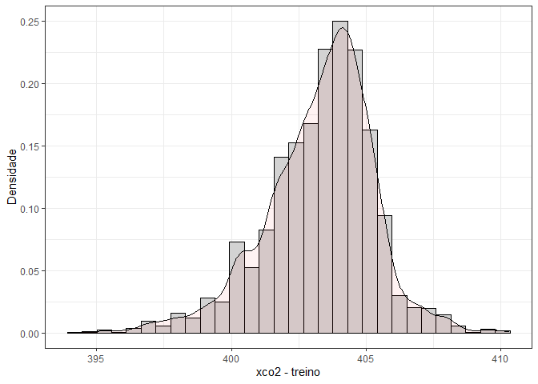<!-- -->

``` r

classe_train  %>% 
  ggplot(aes(x=sif, y=..density..))+
  geom_histogram(bins = 30, color="black",  fill="lightgray")+
  geom_density(alpha=.05,fill="red")+
  theme_bw() +
  labs(x="sif - treino", y = "Densidade")
```

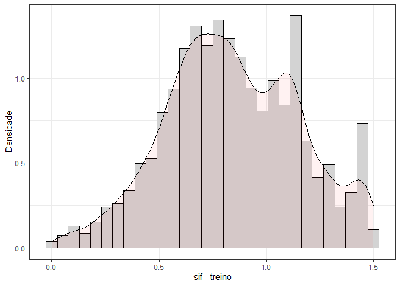<!-- -->

``` r

classe_train  %>% 
  ggplot(aes(x=ndvi, y=..density..))+
  geom_histogram(bins = 30, color="black",  fill="lightgray")+
  geom_density(alpha=.05,fill="red")+
  theme_bw() +
  labs(x="ndvi - treino", y = "Densidade")
```

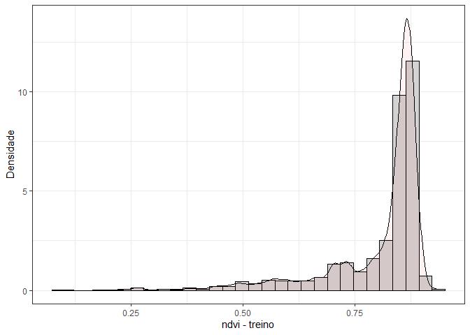<!-- -->

``` r


classe_train  %>% 
  ggplot(aes(x=lai, y=..density..))+
  geom_histogram(bins = 30, color="black",  fill="lightgray")+
  geom_density(alpha=.05,fill="red")+
  theme_bw() +
  labs(x="lai - treino", y = "Densidade")
```

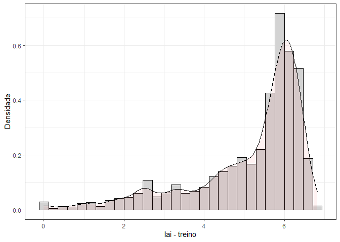<!-- -->

``` r


classe_train  %>% 
  ggplot(aes(x=lst_amp, y=..density..))+
  geom_histogram(bins = 30, color="black",  fill="lightgray")+
  geom_density(alpha=.05,fill="red")+
  theme_bw() +
  labs(x="lst_amp - treino", y = "Densidade")
```

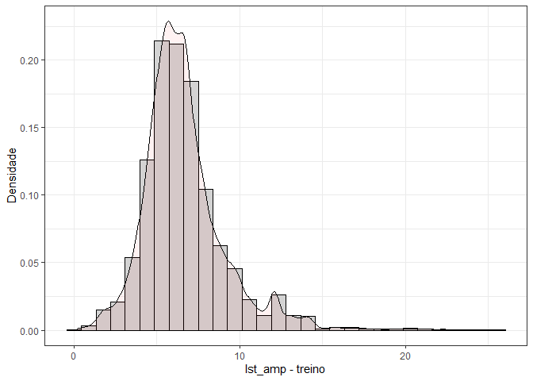<!-- -->

``` r
classe_recipe <- recipe(classe ~ ., 
                      data = classe_train %>% 
            select(classe, xco2:lst_amp) 
) %>%  
  # step_normalize(all_numeric_predictors())  %>% 
#  step_naomit() %>%  
  step_novel(all_nominal_predictors()) %>% 
  step_zv(all_predictors()) %>%
 # step_naomit(c(ts, us)) %>% 
  #step_impute_median(where(is.numeric)) %>% # inputação da mediana nos numéricos
  # step_poly(c(Us,Ts), degree = 2)  %>%  
  step_dummy(all_nominal_predictors())
bake(prep(classe_recipe), new_data = NULL)
#> # A tibble: 3,196 × 6
#>     xco2   sif  ndvi   lai lst_amp classe
#>    <dbl> <dbl> <dbl> <dbl>   <dbl> <fct> 
#>  1  401. 1.15  0.512  1.12    0.92 Con   
#>  2  403. 0.939 0.467  1.42    5.76 Con   
#>  3  407. 0.393 0.722  2.22    3.26 Con   
#>  4  402. 1.25  0.764  3.9     3.94 Con   
#>  5  400. 1.16  0.624  3.12    3.17 Con   
#>  6  399. 1.16  0.46   1.62    2.52 Con   
#>  7  403. 0.891 0.748  2.88    4.36 Con   
#>  8  402. 1.20  0.681  2       3.82 Con   
#>  9  402. 1.07  0.547  3.4     7.84 Con   
#> 10  404. 1.49  0.832  4.23    6.71 Con   
#> # ℹ 3,186 more rows
```

``` r
visdat::vis_miss(bake(prep(classe_recipe), new_data = NULL))
```

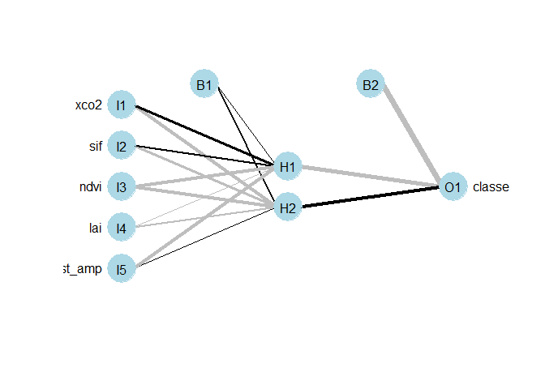<!-- -->

### Regressão logística

``` r
classe_lr_model <- logistic_reg(penalty = tune(), mixture = 1)  |> 
  set_mode("classification") |> 
  set_engine("glmnet")
classe_resamples <- vfold_cv(classe_train, v = 5)
```

``` r
classe_lr_wf <- workflow()   %>%  
  add_model(classe_lr_model) %>% 
  add_recipe(classe_recipe)
```

``` r
grid_lr <- grid_regular(
  penalty(range = c(-4, -2)),
  levels = 20
)
glimpse(grid_lr)
#> Rows: 20
#> Columns: 1
#> $ penalty <dbl> 0.0001000000, 0.0001274275, 0.0001623777, 0.0002069138, 0.0002…
```

``` r
classe_lr_tune_grid <- tune_grid(
  classe_lr_wf,
  resamples = classe_resamples,
  grid = grid_lr,
  metrics = metric_set(
    mn_log_loss, #binary cross entropy
    accuracy,
    roc_auc,
    # kap, # KAPPA
    # precision,
    # recall,
    # f_meas,
  )
)
```

``` r
area_lr <- collect_metrics(classe_lr_tune_grid)  %>%  
  filter(.metric == "roc_auc")  %>%  
  summarise(area = mean(mean),
            desvio_pad = mean(std_err))
```

``` r
collect_metrics(classe_lr_tune_grid)  |> 
  ggplot(aes(x = penalty, y = mean)) +
  geom_point() +
  geom_ribbon(aes(ymin = mean - std_err, ymax = mean + std_err), alpha = 0.1) +
  facet_wrap(~.metric, ncol = 2, scales = "free_y") +
  scale_x_log10()
```

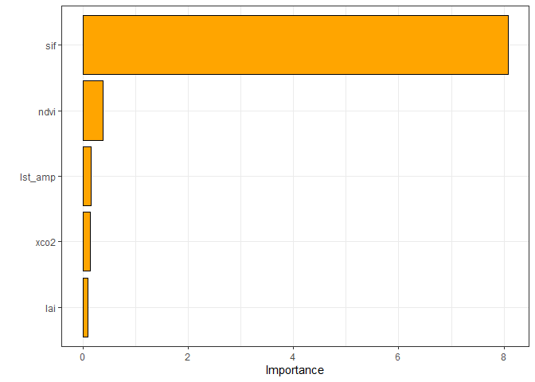<!-- -->

``` r
classe_lr_best_params <- select_best(classe_lr_tune_grid,metric =  "roc_auc")
classe_lr_wf <- classe_lr_wf  %>%  finalize_workflow(classe_lr_best_params)

classe_lr_last_fit <- last_fit(
  classe_lr_wf,
  classe_initial_split
)

# Variáveis importantes
classe_lr_last_fit_model <-classe_lr_last_fit$.workflow[[1]]$fit$fit
vip(classe_lr_last_fit_model,
    aesthetics = list(color = "black", fill = "orange")) +
    theme(axis.text.y=element_text(size=rel(1.5)),
          axis.text.x=element_text(size=rel(1.5)),
          axis.title.x=element_text(size=rel(1.5))
          ) +
  theme_bw()
```

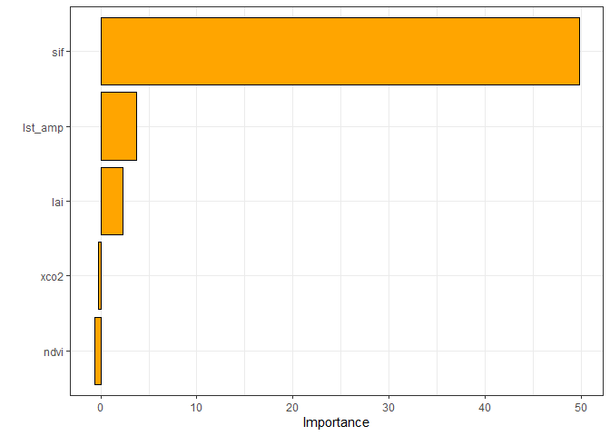<!-- -->

``` r
classe_test_preds_lr <- collect_predictions(classe_lr_last_fit)
classe_roc_curve_lr <- classe_test_preds_lr %>%
  roc_curve(classe, .pred_Con)
autoplot(classe_roc_curve_lr)
```

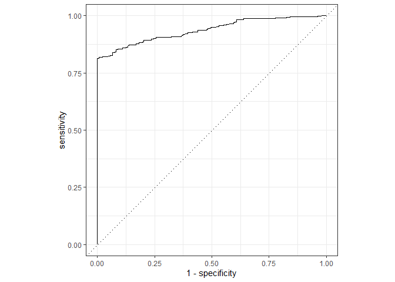<!-- -->

### RNA

``` r
classe_nn_model <- mlp(
  hidden_units = 2) %>% # margin sempre para regressão
  set_mode("classification") %>%
  set_engine("nnet") %>% 
  fit(classe ~ ., data = classe_train %>% 
            select(classe, xco2:lst_amp))
NeuralNetTools::plotnet(classe_nn_model$fit)
```

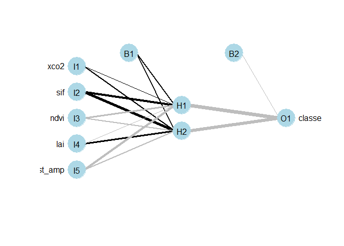<!-- -->

``` r
classe_resamples <- vfold_cv(classe_train, v = 5)
```

``` r
classe_nn_model <- mlp(
  hidden_units = tune(), 
  penalty = tune(),
  epochs = tune()
  ) %>% # margin sempre para regressão
  set_mode("classification") %>%
  set_engine("nnet") 
```

``` r
classe_nn_wf <- workflow()   %>%  
  add_model(classe_nn_model) %>% 
  add_recipe(classe_recipe)
```

``` r
grid_nn <- expand.grid(
  hidden_units = c(1, 2, 3, 5),
  penalty = c(1, 5, 10, 50),
  epochs = c(50, 100, 500, 1000)
)
glimpse(grid_nn)
#> Rows: 64
#> Columns: 3
#> $ hidden_units <dbl> 1, 2, 3, 5, 1, 2, 3, 5, 1, 2, 3, 5, 1, 2, 3, 5, 1, 2, 3, …
#> $ penalty      <dbl> 1, 1, 1, 1, 5, 5, 5, 5, 10, 10, 10, 10, 50, 50, 50, 50, 1…
#> $ epochs       <dbl> 50, 50, 50, 50, 50, 50, 50, 50, 50, 50, 50, 50, 50, 50, 5…
```

``` r
classe_nn_tune_grid <- tune_grid(
  classe_nn_wf,
  resamples = classe_resamples,
  grid = grid_nn,
  metrics = metric_set(roc_auc)
)
```

``` r
area_nn <- collect_metrics(classe_nn_tune_grid)  %>%  
  filter(.metric == "roc_auc")  %>%  
  summarise(area = mean(mean),
            desvio_pad = mean(std_err))
```

``` r
autoplot(classe_nn_tune_grid)
```

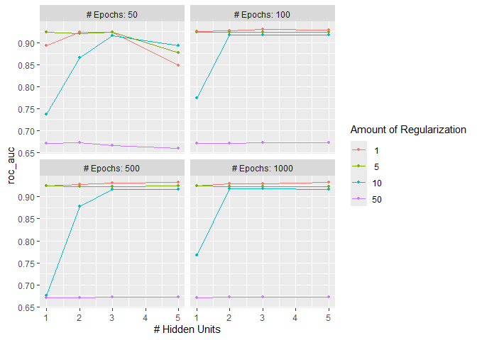<!-- -->

``` r
classe_nn_best_params <- select_best(classe_nn_tune_grid,metric =  "roc_auc")
classe_nn_wf <- classe_nn_wf  %>%  finalize_workflow(classe_nn_best_params)

classe_nn_last_fit <- last_fit(
  classe_nn_wf,
  classe_initial_split
)

# Variáveis importantes
classe_nn_last_fit_model <-classe_nn_last_fit$.workflow[[1]]$fit$fit
vip(classe_nn_last_fit_model,
    aesthetics = list(color = "black", fill = "orange")) +
    theme(axis.text.y=element_text(size=rel(1.5)),
          axis.text.x=element_text(size=rel(1.5)),
          axis.title.x=element_text(size=rel(1.5))
          ) +
  theme_bw()
```

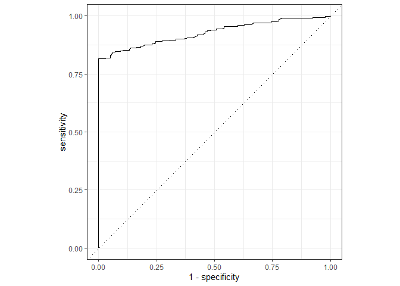<!-- -->

``` r
classe_test_preds_nn <- collect_predictions(classe_nn_last_fit)
classe_roc_curve_nn <- classe_test_preds_nn %>%
  roc_curve(classe, .pred_Con)
autoplot(classe_roc_curve_nn)
```

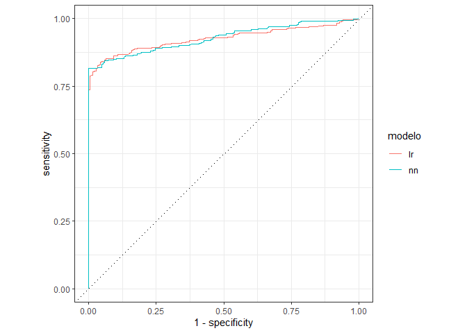<!-- -->

## Comparação

``` r
classe_test_preds <- bind_rows(
  collect_predictions(classe_lr_last_fit) |>  mutate(modelo = "lr"),
  collect_predictions(classe_nn_last_fit) |>  mutate(modelo = "nn")
)

## roc
classe_test_preds  |> 
  group_by(modelo)  |> 
  roc_curve(classe, .pred_Con)  |> 
  autoplot()
```

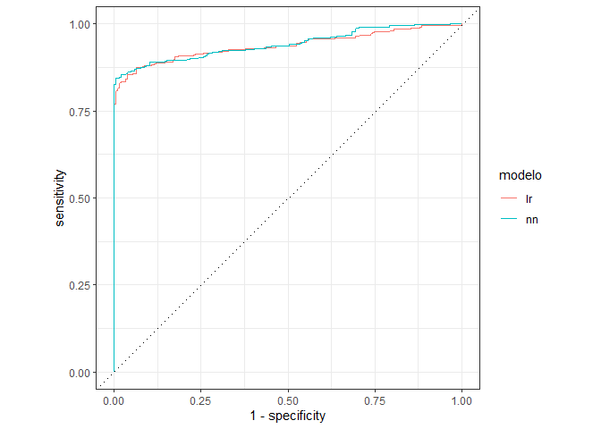<!-- -->

# Trabalhando com a Base da krigagem
