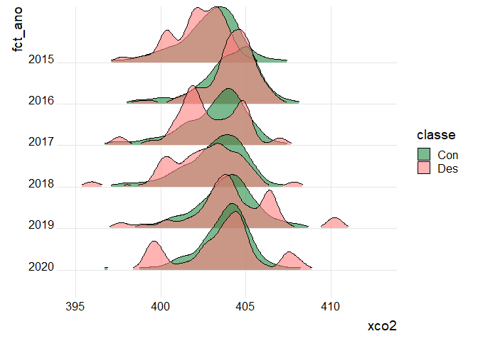

<!-- README.md is generated from README.Rmd. Please edit that file -->

# Análise do Doutorado

## Carregando os pacotes

``` r
library(tidymodels)
library(tidyverse)
library(patchwork)
library(ggspatial)
library(modeldata)
library(ggridges)
library(readxl)
library(fco2r)
library(skimr)
library(ISLR)
library(vip)
```

## Lendo o Banco de dados

``` r
anomalias <- readr::read_rds("data/anomalias.rds")
glimpse(anomalias)
#> Rows: 79,494
#> Columns: 16
#> $ tratamento <chr> "UC", "UC", "UC", "UC", "UC", "UC", "UC", "UC", "UC", "UC",…
#> $ lat        <dbl> -8.620781, -8.620781, -8.620781, -8.869740, -8.869740, -8.8…
#> $ long       <dbl> -62.33607, -62.83555, -72.07608, -54.59401, -61.33709, -61.…
#> $ x          <dbl> 4082521, 4027557, 3011106, 4934661, 4192994, 4165529, 40831…
#> $ y          <dbl> 9036687, 9035452, 8999656, 9019104, 9011189, 9010638, 90088…
#> $ data       <dttm> 2015-01-01, 2015-01-01, 2015-01-01, 2015-01-01, 2015-01-01…
#> $ mês        <dbl> 1, 1, 1, 1, 1, 1, 1, 1, 1, 1, 1, 1, 1, 1, 1, 1, 1, 1, 1, 1,…
#> $ ano        <dbl> 2015, 2015, 2015, 2015, 2015, 2015, 2015, 2015, 2015, 2015,…
#> $ estacao    <chr> "chuvosa", "chuvosa", "chuvosa", "chuvosa", "chuvosa", "chu…
#> $ xco2       <dbl> NA, NA, NA, NA, NA, NA, NA, NA, NA, NA, NA, NA, NA, NA, NA,…
#> $ sif        <dbl> NA, NA, NA, NA, NA, NA, NA, NA, NA, NA, NA, NA, NA, NA, NA,…
#> $ ndvi       <dbl> 0.489, 0.664, 0.488, 0.813, 0.636, 0.700, 0.577, 0.891, 0.5…
#> $ lai        <dbl> 2.300, 2.975, 2.900, 5.550, 3.250, 1.900, 1.400, 3.350, 2.0…
#> $ lst_amp    <dbl> NA, NA, 10.89, 7.38, 5.02, 4.14, NA, NA, NA, NA, 4.46, NA, …
#> $ mediana    <dbl> 403.04, 403.04, 403.04, 403.04, 403.04, 403.04, 403.04, 403…
#> $ anomalia   <dbl> NA, NA, NA, NA, NA, NA, NA, NA, NA, NA, NA, NA, NA, NA, NA,…
```

## FAZER O RIDGE AQUI…

``` r
anomalias %>% 
  mutate(
    fct_ano = fct_rev(as.factor(ano)),
    classe = ifelse(tratamento == "UC_desm" | tratamento == "TI_desm",
                    "Des","Con")
    ) %>% 
  ggplot(aes(y=fct_ano)) +
  geom_density_ridges(rel_min_height = 0.03,
    aes(x=xco2, fill=classe),
    alpha = .6, color = "black", from = 395, to = 413
    ) +
  scale_fill_cyclical(values = c("#238B45","#ff8080"),
                      name = "classe", guide = "legend") +
  theme_ridges() 
```

<!-- -->

``` r
anomalias %>% 
  mutate(
    fct_ano = fct_rev(as.factor(ano)),
    classe = ifelse(tratamento == "UC_desm" | tratamento == "TI_desm",
                    "Des","Con")
    ) %>% 
  ggplot(aes(y=fct_ano)) +
  geom_density_ridges(rel_min_height = 0.03,
    aes(x=anomalia, fill=classe),
    alpha = .6, color = "black", from = -10, to = 10
    ) +
  scale_fill_cyclical(values = c("#238B45","#ff8080"),
                      name = "classe", guide = "legend") +
  theme_ridges() 
```

<!-- -->

## lendo a Base para o Aprendizado de Máquina

``` r
data_set_ml <- anomalias %>% 
  mutate(
    fct_ano = fct_rev(as.factor(ano)),
    classe = as_factor(ifelse(tratamento == "UC_desm" | tratamento == "TI_desm",
                    "Des","Con")
    )) %>% #<-------
  drop_na()
classe_initial_split <- initial_split(data_set_ml, prop = 0.75,
                                      strata = classe)
```

``` r
classe_train <- training(classe_initial_split)
# fco2_test <- testing(fco2_initial_split)
# visdat::vis_miss(fco2_test)
classe_train  %>% 
  ggplot(aes(x=xco2, y=..density..))+
  geom_histogram(bins = 30, color="black",  fill="lightgray")+
  geom_density(alpha=.05,fill="red")+
  theme_bw() +
  labs(x="xco2 - treino", y = "Densidade")
```

<!-- -->

``` r

classe_train  %>% 
  ggplot(aes(x=sif, y=..density..))+
  geom_histogram(bins = 30, color="black",  fill="lightgray")+
  geom_density(alpha=.05,fill="red")+
  theme_bw() +
  labs(x="sif - treino", y = "Densidade")
```

<!-- -->

``` r

classe_train  %>% 
  ggplot(aes(x=ndvi, y=..density..))+
  geom_histogram(bins = 30, color="black",  fill="lightgray")+
  geom_density(alpha=.05,fill="red")+
  theme_bw() +
  labs(x="ndvi - treino", y = "Densidade")
```

<!-- -->

``` r


classe_train  %>% 
  ggplot(aes(x=lai, y=..density..))+
  geom_histogram(bins = 30, color="black",  fill="lightgray")+
  geom_density(alpha=.05,fill="red")+
  theme_bw() +
  labs(x="lai - treino", y = "Densidade")
```

<!-- -->

``` r


classe_train  %>% 
  ggplot(aes(x=lst_amp, y=..density..))+
  geom_histogram(bins = 30, color="black",  fill="lightgray")+
  geom_density(alpha=.05,fill="red")+
  theme_bw() +
  labs(x="lst_amp - treino", y = "Densidade")
```

<!-- -->

``` r
classe_recipe <- recipe(classe ~ ., 
                      data = classe_train %>% 
            select(classe, xco2:lst_amp) 
) %>%  
  # step_normalize(all_numeric_predictors())  %>% 
#  step_naomit() %>%  
  step_novel(all_nominal_predictors()) %>% 
  step_zv(all_predictors()) %>%
 # step_naomit(c(ts, us)) %>% 
  #step_impute_median(where(is.numeric)) %>% # inputação da mediana nos numéricos
  # step_poly(c(Us,Ts), degree = 2)  %>%  
  step_dummy(all_nominal_predictors())
bake(prep(classe_recipe), new_data = NULL)
#> # A tibble: 3,196 × 6
#>     xco2   sif  ndvi   lai lst_amp classe
#>    <dbl> <dbl> <dbl> <dbl>   <dbl> <fct> 
#>  1  403. 0.8   0.507  1.85    5.83 Con   
#>  2  398. 0.912 0.866  3.4     5.78 Con   
#>  3  401. 1.15  0.512  1.12    0.92 Con   
#>  4  407. 0.393 0.722  2.22    3.26 Con   
#>  5  402. 1.25  0.764  3.9     3.94 Con   
#>  6  399. 1.16  0.46   1.62    2.52 Con   
#>  7  403. 0.891 0.748  2.88    4.36 Con   
#>  8  402. 1.07  0.547  3.4     7.84 Con   
#>  9  404. 1.49  0.832  4.23    6.71 Con   
#> 10  404. 0.81  0.797  4.47    4.61 Con   
#> # ℹ 3,186 more rows
```

``` r
visdat::vis_miss(bake(prep(classe_recipe), new_data = NULL))
```

<!-- -->

### RNA

``` r
classe_nn_model <- mlp(
  hidden_units = 2) %>% # margin sempre para regressão
  set_mode("classification") %>%
  set_engine("nnet") %>% 
  fit(classe ~ ., data = classe_train %>% 
            select(classe, xco2:lst_amp))
NeuralNetTools::plotnet(classe_nn_model$fit)
```

<!-- -->

``` r
classe_resamples <- vfold_cv(classe_train, v = 5)
```

``` r
classe_nn_model <- mlp(
  hidden_units = tune(), 
  penalty = tune(),
  epochs = tune()
  ) %>% # margin sempre para regressão
  set_mode("classification") %>%
  set_engine("nnet") 
```

``` r
classe_nn_wf <- workflow()   %>%  
  add_model(classe_nn_model) %>% 
  add_recipe(classe_recipe)
```

``` r
grid_nn <- expand.grid(
  hidden_units = c(1,2),
  penalty = c(1,5),
  epochs = c(50, 100)
)
glimpse(grid_nn)
#> Rows: 8
#> Columns: 3
#> $ hidden_units <dbl> 1, 2, 1, 2, 1, 2, 1, 2
#> $ penalty      <dbl> 1, 1, 5, 5, 1, 1, 5, 5
#> $ epochs       <dbl> 50, 50, 50, 50, 100, 100, 100, 100
```

``` r
classe_nn_tune_grid <- tune_grid(
  classe_nn_wf,
  resamples = classe_resamples,
  grid = grid_nn,
  metrics = metric_set(roc_auc)
)
```

``` r
area_nn <- collect_metrics(classe_nn_tune_grid)  %>%  
  filter(.metric == "roc_auc")  %>%  
  summarise(area = mean(mean),
            desvio_pad = mean(std_err))
```

``` r
autoplot(classe_nn_tune_grid)
```

<!-- -->

``` r
classe_nn_best_params <- select_best(classe_nn_tune_grid, "roc_auc")
classe_nn_wf <- classe_nn_wf  %>%  finalize_workflow(classe_nn_best_params)

classe_nn_last_fit <- last_fit(
  classe_nn_wf,
  classe_initial_split
)

# Variáveis importantes
classe_nn_last_fit_model <-classe_nn_last_fit$.workflow[[1]]$fit$fit
vip(classe_nn_last_fit_model,
    aesthetics = list(color = "black", fill = "orange")) +
    theme(axis.text.y=element_text(size=rel(1.5)),
          axis.text.x=element_text(size=rel(1.5)),
          axis.title.x=element_text(size=rel(1.5))
          ) +
  theme_bw()
```

<!-- -->

``` r
classe_test_preds_nn <- collect_predictions(classe_nn_last_fit)
classe_roc_curve_nn <- classe_test_preds_nn %>%
  roc_curve(classe, .pred_Con)
autoplot(classe_roc_curve_nn)
```

<!-- -->
